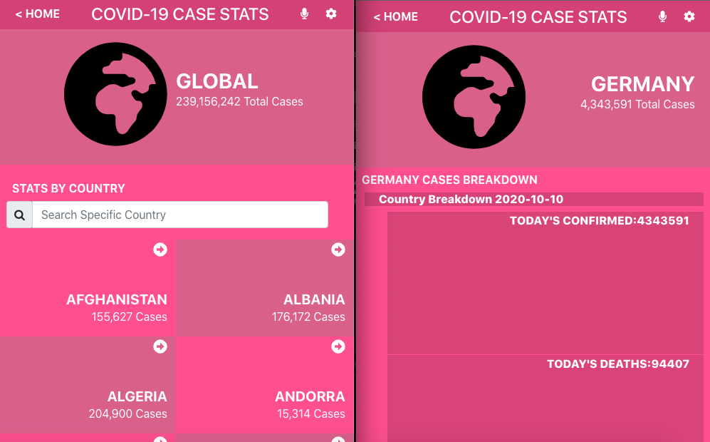
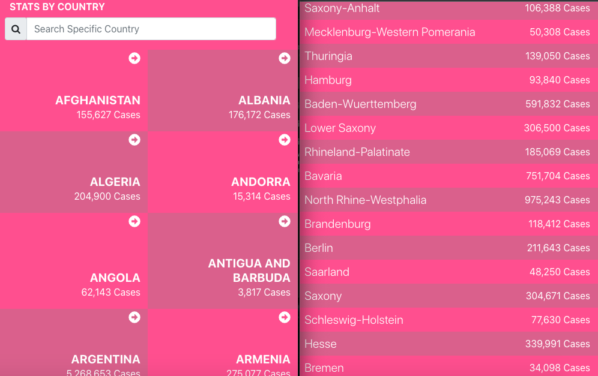

# React capstone project - Metrics webapp (Covid-19 STATS)

- This React capstone project is about building a mobile web application to check a list of metrics (numeric values) that you will create making use of React and Redux.

- I selected an API that provides numeric data about a Covid-19 Stats because is a global concern that is affecting almost the entire part of the world, my mobile app is build around it.
  
- The webapp have several pages:
one page with a list of items that could be filtered by some parameters; like  country name. 
one page for the item details; the detail page of country case break down.
## Both page side side up section of application

## Both page side side down section of application

## Built With

- JavaScript ES6
- JSX
- HTML & CSS
- Bootstrap
- React and Redux
- Git and Github flow
- VSCode
- Jest
- Netlify
- Linter Checkers

## Deployment Live Demo

 - Deployed with on Netlify
  - [Live Demo](https://cocky-williams-122084.netlify.app/)
## Video Presentation
 - [loom video](https://loom.com/share/f5b7840114e645999084a901c03c2eca) 
## Getting Started

To get a local copy up and running follow these simple example steps.

### Prerequisites

- IDE to edit and run the code (We use Visual Studio Code 🔥).
- [Node.js](https://nodejs.org/en/download/) already downloaded.

### Install

To get a local copy up and running follow these simple example steps.
- Open terminal
- Clone this project using the command `git clone https://github.com/DanSam5K/Covid-19-Tracking-App.git`
- `cd <clone>` folder
- Run `npm install` to install all project dependencies
- Run `npm start` in your local browser or using Live Server in Visual Studio Code.

## Author 👤 

👨‍💻 **Daniel Samuel**

- Github: [DanSam5k](https://github.com/DanSam5k)
- Twitter: [@_dan_sam](https://twitter.com/_dan_sam)
- Linkedin: [dansamuel](https://www.linkedin.com/in/dansamuel/)

## 🤝 Contributing

Contributions, issues, and feature requests are welcome!

Feel free to check the [issues page](https://github.com/DanSam5K/Covid-19-Tracking-App/issues).

## Show your support

Give a ⭐️ if you like this project!

## Acknowledgments
- Original project design idea by [Nelson Sakwa on Behance.](https://www.behance.net/sakwadesignstudio) 🙌
- Hat tip to anyone whose code was used 🔰
- Inspiration 💘
- Microverse program ⚡
- Our standup team 🏹
- Our family's support 🙌

## 📝 License

This project is [MIT](./LICENSE) licensed.
